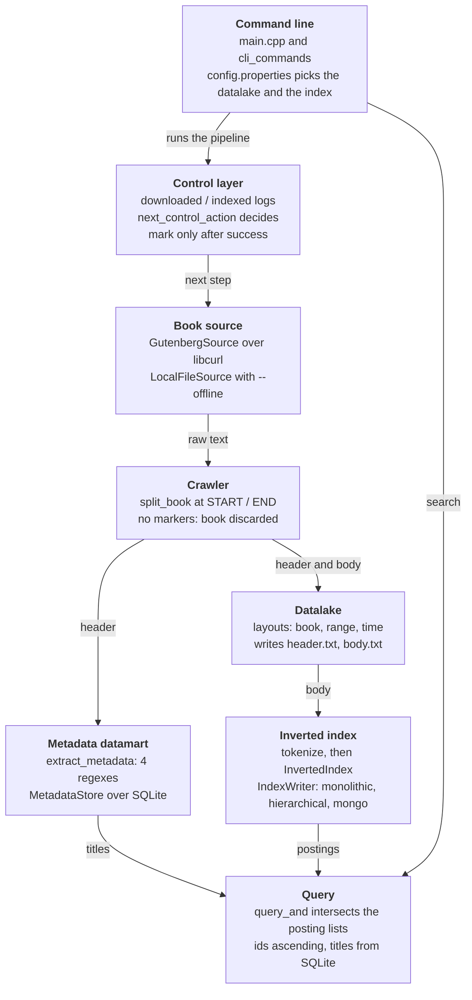

# C++ Module Report — Stage 1 Data Layer

Carlos Falcón Brito · group BigData-Ulpgc · 2026-10-04

The C++ module downloads, splits, stores, indexes and searches the 200 Project Gutenberg books of the group's shared dataset, and reproduces the Java module's results exactly wherever they must match: byte-identical datalake sizes and the same index term counts, with 232 passing tests.

## At a glance

The module is one of three implementations of the same contract, [`shared/SPEC.md`](../../shared/SPEC.md); Java and Python are the other two.

| Item | Value |
| --- | --- |
| Author | Carlos Falcón Brito (C++ implementation), group BigData-Ulpgc |
| Language and build | C++20, CMake 3.20+ with Ninja, `make` shortcuts |
| Libraries | SQLite3, libcurl, mongo-cxx-driver 4.x; nlohmann/json and GoogleTest fetched by CMake |
| Size | 144 files: 1,802 lines of headers, 3,381 of sources, 3,521 of tests |
| Tests | 232 GoogleTest tests, all passing; 11 of them need the group's MongoDB |
| History | 60 commits touching `cpp/`, 2026-09-20 to 2026-10-04 (57 by the author) |
| Dataset | The 200 Gutenberg books of `shared/book_ids.txt`; a 15-book offline sample in `sample_dataset/` |
| Command line | `pipeline`, `search`, `status`, `config`, `benchmark` |
| Benchmarks | All 12 SPEC experiments, results in `cpp/benchmarks/results/` |
| Documentation | `cpp/docs/`: this report, the user guide and the in-depth development log (70 entries) |
| Repository | [github.com/BigData-Ulpgc/stage_1](https://github.com/BigData-Ulpgc/stage_1), folder `cpp/` |

## Architecture

The module is five layers wired by a thin command line: a book is fetched, split, stored, described in SQLite, indexed, and finally answered by AND queries.



Wherever a choice exists, the box sits behind an interface (`HttpClient`, `Datalake`, `Clock`, `IndexWriter`). That is how the benchmarks swap layouts and indexes, and how the tests use fakes instead of the network.

## Code structure

The folders mirror the Java module's packages, so a reader can move between both implementations; `include/stage1/`, `src/` and `tests/` share the same layout, and dependencies only point downwards in the table.

| Folder | Main classes and functions | Responsibility |
| --- | --- | --- |
| `util/` | `write_text_file`, `read_text_file`, `trim` | File and text helpers shared by every layer |
| `crawler/` | `HttpClient` (interface), `CurlHttpClient`, `GutenbergSource`, `LocalFileSource`, `split_book` | Fetch a book (network or offline sample) and split it into header and body at the START/END markers (SPEC 2) |
| `datalake/` | `Datalake` (interface), `BookBasedDatalake`, `RangeBasedDatalake`, `TimeBasedDatalake`, `Clock` | Store each book's header and body in one of three folder layouts (SPEC 3) |
| `datamart/metadata/` | `extract_metadata`, `MetadataStore` | Parse title, author, language and release date with the SPEC regexes; store them in SQLite (SPEC 4) |
| `datamart/index/` | `tokenize`, `InvertedIndex`, `IndexWriter` (interface), `MonolithicIndexWriter`, `HierarchicalIndexWriter`, `MongoIndexWriter`, readers | Tokenize bodies (SPEC 5), keep the inverted index in memory and persist it in three structures (SPEC 6) |
| `query/` | `query_and` | AND search: intersection of the posting lists, ascending ids (SPEC 7) |
| `control/` | `ControlLog`, `next_control_action`, `run_pipeline_step` | Control layer: decide the next action and mark a book only after its step succeeded (SPEC 8) |
| `config/` | `AppConfig`, `create_datalake`, `create_index_writer`, `open_index` | Read `config.properties` and build the chosen datalake and index (the only place that maps a name to a class) |
| `benchmark/` | `measure_elapsed_ms`, `JavaRandom`, `load_sample_books`; subfolders `datalake/`, `index/`, `metadata/` | The 12 SPEC experiments, under the same conditions as the Java module (SPEC 9 and 10) |
| root | `main.cpp`, `cli_commands` | Thin command line: parses arguments and wires the components together |

Every storage choice sits behind an interface (`Datalake`, `IndexWriter`, `HttpClient`, `Clock`), so the pipeline, the tests and the benchmarks plug in any implementation, including test fakes.

## Pipeline flow

The pipeline advances one step at a time: each step either downloads one book or indexes one, and marks it in the control layer only after the step succeeded, so an interrupted run resumes without losing or repeating books.

1. **Start-up.** `main.cpp` reads any `-Dkey=value` overrides; `load_cli_config` merges them with `cpp/config.properties` into an `AppConfig`. `run_pipeline_command` then builds the pieces:
    - the book source: `GutenbergSource` over `CurlHttpClient`, or `LocalFileSource` with `--offline`;
    - the datalake: `create_datalake`, with a `SystemClock` for `time`;
    - the stores: `MetadataStore` and the index writer from `create_index_writer`;
    - the control logs: two `ControlLog` files.
2. **Resume.** The in-memory `InvertedIndex` is rebuilt from the body of every book already marked indexed, read through the path the metadata stored. If the chosen index structure is missing, partial or stale (its term count differs), it is written whole once.
3. **Decide.** `next_control_action` reads only the two logs: index the first downloaded-but-not-indexed book; otherwise download the first book not yet downloaded; otherwise there is nothing left to do.
4. **Download a book.** `BookSource::fetch` returns a `DownloadResult`, then:
    - `split_book` cuts it at the START/END markers; a book without both is discarded;
    - `Datalake::write` stores the header and body;
    - `extract_metadata` parses the header, and `MetadataStore::insert_book` saves the row and the two paths;
    - only then, `ControlLog::mark` records the id as downloaded.
5. **Index a book.**
    - `MetadataStore::find_by_id` gives the body's path, and `tokenize` turns the body into terms with stopwords removed;
    - the book's distinct terms go into `InvertedIndex::add_book`;
    - `IndexWriter::update_terms` persists only those terms, as Java's `flush()` does;
    - only then is the book marked indexed.
6. **Failure.** A failed fetch or a missing marker returns a `StepResult` that is not completed, with the reason. The book stays unmarked, the run stops with exit code 1, and the next run retries it.
7. **Search.** `search` tokenizes the query like a book, opens the configured index with `open_index`, intersects the posting lists with `query_and`, and prints each id with its title from SQLite.

## Design decisions

Each decision below is recorded, with the alternatives discarded and the measurements behind it, in [`DEVLOG.md`](DEVLOG.md) (entry numbers in brackets).

| Decision | Alternative discarded | Why |
| --- | --- | --- |
| One interface per storage choice: `Datalake`, `IndexWriter`, `HttpClient`, `Clock` | Concrete classes wired directly | The pipeline, tests and benchmarks plug in any layout, index or fake without changing the code that uses them |
| Control layer: write first, mark after; `next_control_action` reads only the logs | Marking before writing, or deciding inside the I/O code | An interrupted run loses or repeats nothing (SPEC 8), and the decision is unit-tested without disk or network |
| Each indexed book persists only its own terms (`update_terms`) [40, 68] | Rewriting the whole index per book | The rewrite made `hierarchical` over 100 times slower than `monolithic`; updating only the changed terms was measured 3–4 times faster |
| SQLite inserts grouped in one transaction per batch [37, 62] | One commit per row | Benchmarks showed noisy, low throughput; batching was about 2.5 times faster, and matches Java's `saveAll` |
| `TimeBasedDatalake::locate` remembers what it wrote [31, 32] | Scanning the day/hour folders, as Java does | A path cannot be computed from the id; remembering is fast but lasts one process. Indexing reads paths from SQLite, so the pipeline is unaffected |
| Structures chosen in `config.properties`, overridable with `-D` [68] | Hardcoded `book` + `monolithic`; per-command flags | Same keys and defaults as Java (`time`, `monolithic`); one file keeps `pipeline` and `search` on the same index |
| Index rebuilt in memory at start-up, then checked against the stored one [68] | Trusting that the stored index exists | Found by testing: 5 stale documents in the real Mongo collection made `search` answer from them |
| Paths fixed at build time (CMake macros) | Paths relative to the working directory | The binary finds `shared/`, `data/` and `config.properties` from any folder |
| Benchmarks reproduce Java's conditions in code [55–64] | Each language measuring its own way | Same untimed setup, same data, same random choices (`JavaRandom`), same checks: differences come from the languages, not the method |
| Offline mode over `sample_dataset/` [48] | Network-only pipeline | Instructors can test the whole pipeline in about a second without network; the 15 split books are byte-verified |

## Development process

The module was built in nine planned phases, one small step at a time: each step added a component with its tests, was committed on its own, and logged its reasoning in [`DEVLOG.md`](DEVLOG.md). Once the first benchmarks ran, the group fixed a common dataset (SPEC 10), and the C++ benchmarks were then aligned line by line with the Java module's code.

| Date | Milestone | What it involved |
| --- | --- | --- |
| 2026-10-04 | Configurable structures; documentation; final fixes | `config.properties` and `-D` overrides; stale or partial indexes rewritten at start-up; the documentation gathered in `cpp/docs/` with this report; a test that failed on Linux fixed; 20 stale files left by a merge removed |
| 2026-10-03 | Index results with native Docker | A teammate ran the five index experiments, MongoDB included, on a machine with native Docker |
| 2026-10-03 | Parity with Java (steps A–D) and MongoDB | All 12 experiments rewritten under Java's conditions; `JavaRandom`; simulated clock; Mongo measured, with a bulk write that cut an index update from 3,421 to about 300 ms per book |
| 2026-10-03 | Shared dataset (SPEC 10) | 200 books; sizes N = 50, 100, 200 taken as the lowest ids; reference term counts; `sample_dataset/` and the offline mode; two bugs found and fixed |
| 2026-10-02 | Reorganisation and user guide | Folders mirroring the Java packages; the user guide, now `cpp/docs/USER_GUIDE.md` |
| 2026-10-01 | All 12 SPEC experiments; `search` and `status` | Running them on real books exposed two performance bugs, both fixed and measured |
| 2026-09-29 to 09-30 | Phases 4–8 | Datalake layouts, inverted index, its three persistence structures, AND queries, control layer; first runnable pipeline |
| 2026-09-25 to 09-28 | Phases 2–3 | Header/body split, Gutenberg client behind interfaces, metadata extraction and SQLite |
| 2026-09-20 | Phase 1 | CMake environment, tokenizer and stopwords |

## Testing and verification

All 232 GoogleTest tests pass with `make test`. The 11 that need MongoDB are skipped without a server and pass against the group's container. No test touches the network or the real `data/` folder: they use `FakeHttpClient`, `FakeClock` and throw-away `TempDir` folders.

| Area | Tests | What they check |
| --- | --- | --- |
| `benchmark/` | 71 | Rows, units and order of every experiment as in Java's CSVs; `JavaRandom` against values printed by a real JVM; the simulated clock; the verification each experiment performs |
| `datamart/index/` | 49 | Tokenizer and stopwords (SPEC 5); the in-memory index; each writer and reader, Mongo included |
| `datalake/` | 25 | The three layouts' paths, `locate` and `list_book_ids` |
| `control/` | 24 | The control decision, the logs, and full pipeline steps (download, index, failures never marked) |
| `datamart/metadata/` | 22 | The four SPEC regexes; SQLite inserts, batches (all or nothing) and the three lookups |
| `crawler/` | 19 | Marker split (SPEC 2), the download client and the offline source, which re-splits the real sample byte for byte |
| `config/` | 12 | Configuration precedence and errors; both factories |
| `query/` | 7 | AND intersection and its edge cases |
| Smoke | 3 | The build links and runs |

Beyond the unit tests, the results were checked against the other implementations:

- The index has exactly the SPEC's reference counts at N = 50 / 100 / 200 (58,834 / 78,820 / 129,356 terms; 360,970 / 759,087 / 1,581,064 postings), as in Java and Python.
- `datalake_storage` matches Java byte for byte: 128,980,349 bytes in each layout, 200 / 47 / 21 folders, and the same allocated bytes.
- Every benchmark verifies before it reports. A written index must answer like the in-memory one; lookups must find every book; a recovery must leave 0 lost and 0 duplicated books.
- A test that failed only on Linux was reproduced in an Ubuntu 24.04 (glibc 2.39) container and fixed.

## Benchmarks

The module runs all 12 SPEC experiments under the Java module's exact conditions, so differences between the two come from the languages, not from the method.

- **Method:** 2 discarded warm-ups and 5 measured runs. Preparation is never timed: an empty datalake, index or database before each run, and books tokenized beforehand.
- **Data:**
    - datalake experiments: the 200 real books;
    - index experiments: the 50, 100 and 200 books with the lowest ids;
    - metadata experiments: 1,000, 10,000 and 100,000 rows from SPEC 10.2's generator.
- **Same choices:** `JavaRandom(42)` reproduces Java's lookup order and query workload, and a simulated clock (10 books per hour) gives the `time` layout Java's folders.
- **Same output:** the same metrics, units and row order as Java's CSVs, in `cpp/benchmarks/results/real/` (datalake, index) and `synthetic/` (metadata).
- **Machines differ:**
    - Java ran on its author's machine;
    - the C++ datalake and metadata runs ran on macOS;
    - the C++ index runs ran on a teammate's Linux machine with native Docker.

    Read the tables for orders of magnitude and rankings, not exact times.

Datalake, 200 books (median; C++ / Java):

| Layout | Write all (ms) | Lookup (µs per book) | Detect new (ms) | Recover (ms) |
| --- | --- | --- | --- | --- |
| `book` | 228 / 194 | 2.52 / 3.30 | 0.98 / 1.24 | 19.1 / 23.8 |
| `range` | 192 / 199 | 2.92 / 8.32 | 1.66 / 2.58 | 22.3 / 25.2 |
| `time` | 187 / 211 | 0.07 / 94.53 | 1.16 / 2.08 | 20.0 / 19.8 |

Inverted index, 200 books (median; C++ / Java):

| Structure | Build (ms) | Query (µs) | Add a book (ms) | Memory after open (MB) | Disk (MB) |
| --- | --- | --- | --- | --- | --- |
| `monolithic` | 1,849 / 1,686 | 1.4 / 4.5 | 300 / 85 | 54.1 / 100.3 | 8.89 / 8.89 |
| `hierarchical` | 6,546 / 11,339 | 22.0 / 48.3 | 482 / 1,239 | 0.0 / 0.0 | 7.25 / 7.25 |
| `mongo` | 3,359 / 14,286 | 314.6 / 344.8 | 922 / 1,053 | 0.0 / 0.0 | 13.91 / 14.13 |

Metadata, 100,000 rows (median; C++ / Java):

| Variant | Insert (rows/s) | By id (µs) | By author (µs) |
| --- | --- | --- | --- |
| `sqlite` | 454,570 / 50,036 | 9.0 / 24.0 | 15.4 / 52.0 |
| `sqlite_no_index` | 915,179 / 58,103 | 9.3 / 24.4 | 5,869 / 8,460 |

What the numbers show:

- **Same data, same sizes.** Datalake bytes (128,980,349 in each layout) and the file-based index sizes are identical in both languages; Mongo's differ by under 2% (insert pattern).
- **Datalake.** `time` spreads files best (at most 20 entries per folder, against 200 and 220) but needs a search to locate a book. Java scans its folders (94.5 µs). The C++ 0.07 µs comes from an in-memory map, so it is not the same operation.
- **Index.** `monolithic` answers fastest but must load the whole index: C++ keeps 54 MB after opening it, against Java's 100 MB. `hierarchical` and `mongo` keep almost nothing in memory and update per term. C++'s `monolithic` update is slower, most likely because rewriting the 8.9 MB JSON per book with nlohmann/json costs more than with Java's Jackson.
- **Metadata.** The `author` and `title` indexes are what keep lookups flat. Without them, an author lookup at 100,000 rows takes 5.9 ms instead of 15 µs, about 380 times slower.
- **Languages.** C++ wins where its own code does the work (CPU, memory, many small SQLite calls without JDBC); disk-bound work ties, because the operating system does it.

## How to run it

The fastest check takes about a second and needs no network: build, run the pipeline over the 15 sample books, and search.

**Requirements.**

- macOS: `xcode-select --install`, then `brew install cmake ninja mongo-cxx-driver`.
- Linux (Ubuntu/Debian): `sudo apt install build-essential cmake ninja-build libsqlite3-dev libcurl4-openssl-dev`, plus mongo-cxx-driver 4.x.
- CMake downloads nlohmann/json and GoogleTest on the first build.
- MongoDB is optional: without a server, its tests and benchmark rows are skipped.

**Build, test and try it**, from the `cpp/` folder:

```bash
make
make test
B=./build/release/search_engine_stage1
$B pipeline 30 --offline
$B search whale island
```

The search answers books 76, 84 and 2701 with their titles; `make` builds in Release mode.

| Command | What it does |
| --- | --- |
| `$B pipeline <N>` | Up to N steps over the 200 books; each step downloads or indexes one book (`pipeline 400` processes everything) |
| `$B pipeline <N> --offline` | The same, reading the 15 books of `sample_dataset/raw/` instead of the network |
| `$B search <words...>` | AND search on the configured index, with titles |
| `$B status` | Books in the dataset, downloaded, indexed and pending |
| `$B config` | The configuration file used and the active structures |
| `$B benchmark <experiment>` | One of the 12 SPEC experiments; writes its CSV under `benchmarks/results/` |

**Choosing the structures.** `cpp/config.properties` sets `datalake.structure` (`time`, `book` or `range`) and `index.structure` (`monolithic`, `hierarchical` or `mongo`). Any key can be changed for one run, before the command:

```bash
$B -Dindex.structure=hierarchical pipeline 400
$B -Dindex.structure=hierarchical search whale island
```

**MongoDB.** From the repository root, `docker compose up -d` starts the group's server (MongoDB 8.2.12). Benchmarks use the `search_engine_bench` database and tests use `search_engine_test`, so neither touches the real index.

**Benchmarks.** Download the dataset once with `$B pipeline 400`, then run any experiment, for example `$B benchmark datalake_storage` or `$B benchmark index_build`. The index experiments run at N = 50, 100 and 200 by themselves.

**Where things go.**

- Everything the pipeline produces goes under `cpp/data/`, which git ignores:
    - `datalake/<layout>/`;
    - `datamarts/metadata.db`;
    - `datamarts/inverted_index.json` or `inverted_index/`;
    - `control/`.
- Benchmarks use `cpp/benchmarks/work/` as scratch space.
- Exit codes: 0 on success, 1 on a usage or configuration error or a failed step.

## Known limitations and open points

None of these affects the results reported above. Each one is documented, with its reason, in the design log.

- **`time` lookup lasts one process.** `TimeBasedDatalake::locate` remembers what that instance wrote, while Java scans the folders. The pipeline is unaffected, because it reads book paths from SQLite.
- **Datalake writes are not atomic.** Java writes to a `.tmp` file and renames it; C++ relies on the control layer's write-first, mark-after rule. After a simulated crash, `book` and `range` keep 20 leftover `.tmp` files, which no metric counts.
- **Start-up cost grows with the dataset.** The in-memory index is rebuilt from every indexed book's body on each run.
- **Untested wiring.** `cli_commands.cpp` has no unit tests; it was checked by hand with the real CLI.
- **Sequential tests only.** Five pipeline tests share temporary folder names, so `ctest -j` fails them; `make test` runs sequentially.
- **Mongo connections.** Each Mongo write opens a new client connection, where Java keeps one per index.
- **Partial configuration.** Only Java's two structure keys were ported. Paths, the Mongo URI and HTTP timeouts are not configurable, and the download client sets no timeout.
- **Open with the group:**
    - which datalake and index the final system uses, to be justified in the group report (the default is `time` + `monolithic`, as in Java);
    - whether every language stores its results in per-category subfolders, as C++ does, or flat, as Java and Python do (SPEC 10.4).

## Documentation

The module's documentation lives in this folder, `cpp/docs/`: three files, each for a different reader. The repository's root `README.md` links to all three.

| File | What it holds | For whom |
| --- | --- | --- |
| [`MODULE_REPORT.md`](MODULE_REPORT.md) | This report: architecture, code structure, pipeline flow, decisions, process, tests, benchmarks, how to run | Instructors and readers of the project |
| [`USER_GUIDE.md`](USER_GUIDE.md) | How to build, test and run: requirements, commands, configuration, where data goes, checks by hand, exit codes | Anyone running the module |
| [`DEVLOG.md`](DEVLOG.md) | The in-depth development log: 70 entries, from the first CMake file to the final version, with every decision, the alternatives discarded and the measurements behind them; it opens with an index of all entries | Reviewers who want the full reasoning |

## Sources

Everything in this report comes from the repository's `main` branch as of 2026-10-04:

- [`cpp/docs/USER_GUIDE.md`](USER_GUIDE.md): user guide (build, commands, data layout, exit codes)
- [`cpp/docs/DEVLOG.md`](DEVLOG.md): the in-depth development log, 70 entries
- [`shared/SPEC.md`](../../shared/SPEC.md): the contract shared by the three implementations
- [`cpp/config.properties`](../config.properties): the active structures
- [`cpp/benchmarks/results/`](../benchmarks/results/) and [`java/stage1/benchmarks/results/`](../../java/stage1/benchmarks/results/) (`real/` and `synthetic/`): the CSVs behind the benchmark tables
- [Root `README.md`](../../README.md): the project overview and the other two modules
